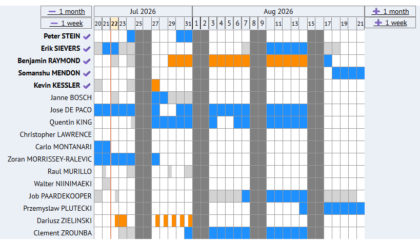
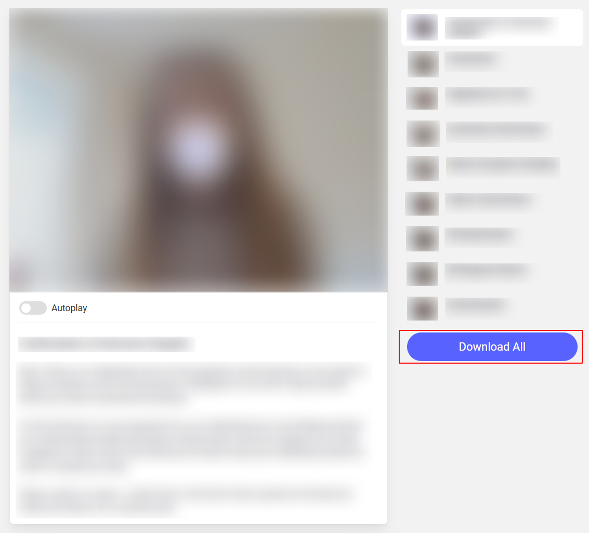
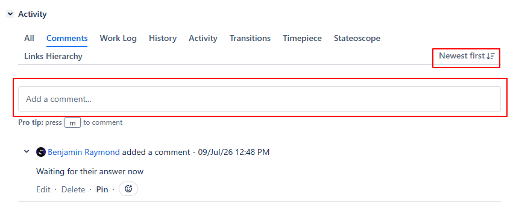
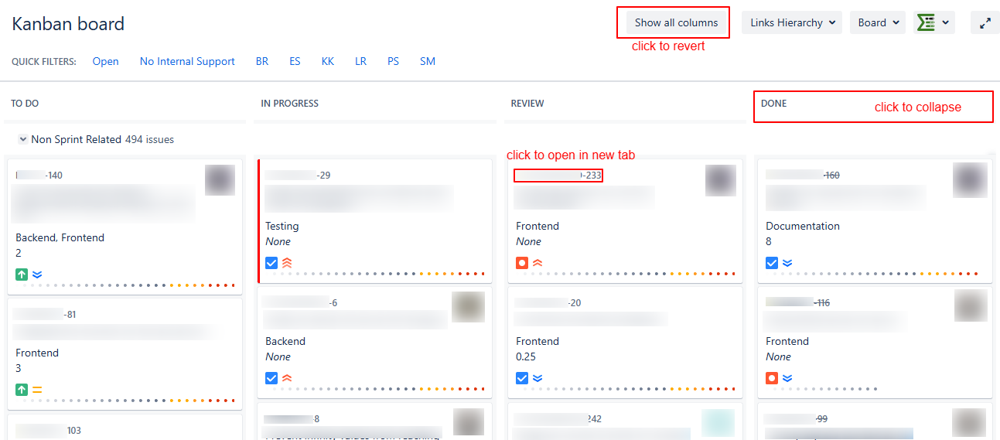
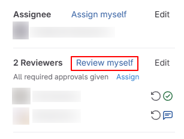
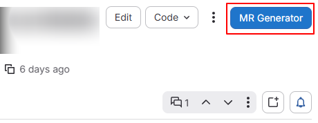

# CERN Userscripts

Userscripts to make your life easier when working @t CERN

## Prerequesite

Ensure you have `TamperMonkey` or `GreaseMonkey` installed in your browser.

## Userscripts

Available userscripts are grouped below based on target-audience. Click on the `Install` link to install any of them.

### CERN-wide

- EDH

  - Absence Overview ([Install](https://github.com/7PH/cern-userscripts/raw/refs/heads/master/src/edh.cern.ch/fix-absence-overview.user.js))
    - Add user-pinning feature
    - Add months and day labels
    - Automatically show data starting from previous Monday on page load
    - Display shortened version of long names
    - Highlight today's date
    

      
Screenshot

      

    

- HireFlix

  - Add "Download" button to submitted interview page ([Install](https://github.com/7PH/cern-userscripts/raw/refs/heads/master/src/hireflix.com/hireflix-download-interview-submissions-button.user.js))
    

      
Screenshot

      

    

- JIRA
  - Move comment input near the latest comment ([Install](https://github.com/7PH/cern-userscripts/raw/refs/heads/master/src/its.cern.ch/jira-fix-comment-input.user.js))
    

      
Screenshot

      

    

  - Click on an issue title in a sprint board will open in a new tab instead of the side panel ([Install](https://github.com/7PH/cern-userscripts/raw/refs/heads/master/src/its.cern.ch/jira-fix-links.user.js))
  - Collapse Kanban board columns by clicking on their header ([Install](https://github.com/7PH/cern-userscripts/raw/refs/heads/master/src/its.cern.ch/jira-collapsible-columns.user.js))
    

      
Screenshot (open in new tab + collapsible columns)

      

    

- GitLab

  - Add "Assign myself" / "Review myself" buttons to merge request sidebars ([Install](https://github.com/7PH/cern-userscripts/raw/refs/heads/master/src/gitlab.cern.ch/gitlab-assign-myself-button.user.js))
    

      
Screenshot

      

    

 

### SY-EPC-CCS specific

These userscripts are likely only interesting for you if you are in `SY-EPC-CCS`.

- GitLab

  - Add link to the MR Generator from merge request pages ([Install](https://github.com/7PH/cern-userscripts/raw/refs/heads/master/src/gitlab.cern.ch/gitlab-mr-generator-button.user.js))
    

      
Screenshot

      

    

## Troubleshooting (Chrome, Tampermonkey)

If the userscripts don't work after installing Tampermonkey, try:

- Entering "chrome://extensions/" in your navbar and enabling Developer Mode (top-right)
- Clicking "Details" on "Tampermonkey" and then checking "Allow Userscripts"
- Then the userscripts should be enabled
